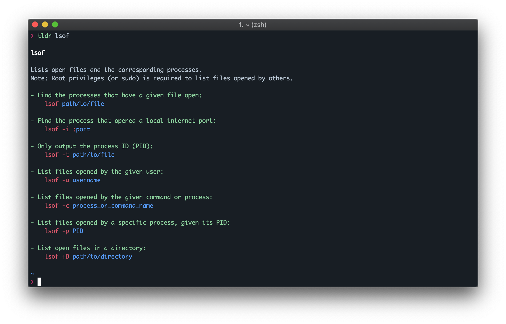
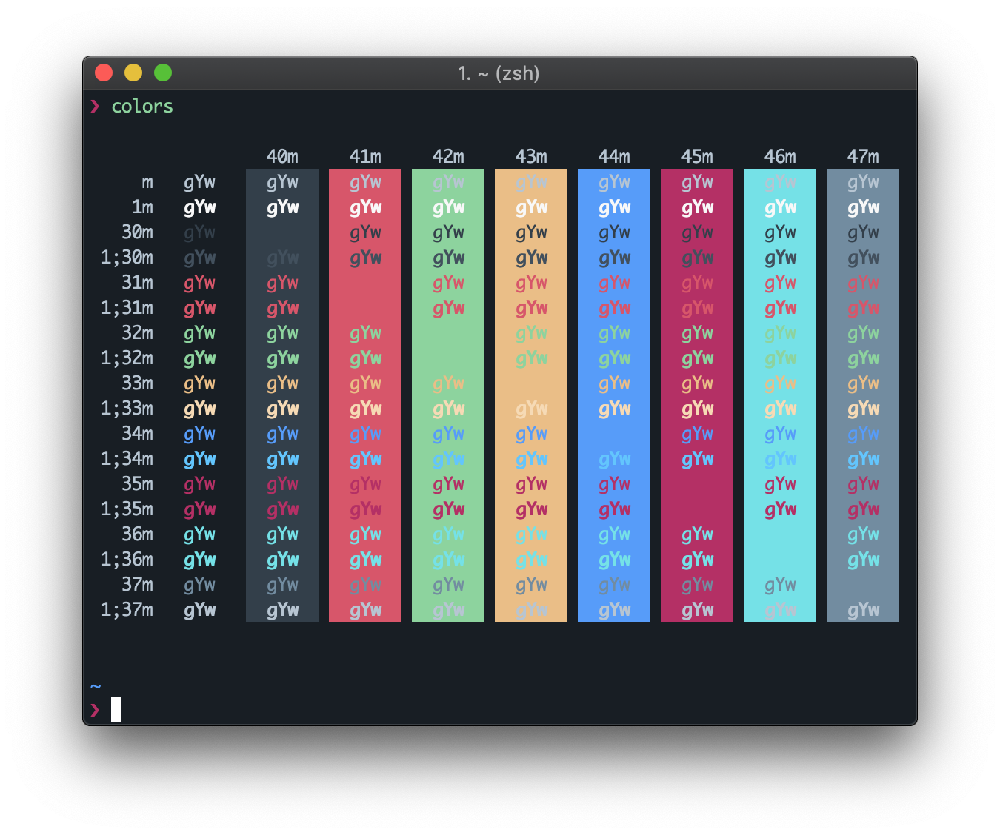

# iterm2-city-lights

A [City Lights](http://citylights.xyz) theme for [iTerm2](https://www.iterm2.com) with focus in mind using a gorgeous dark atmosphere. Matches macOS Mojave Dark Mode in perfection.

* using [ZIM](https://github.com/zimfw/zimfw) (Zsh IMproved) shell with built-in [pure](https://github.com/sindresorhus/pure) theme.

## Usage

- Clone the repository or right-click [`City Lights.itermcolors`](https://github.com/ruimarinho/iterm2-city-lights/raw/master/City%20Lights.itermcolors) and choose `Download Linked File As…`.
- Double-click the downloaded file or go to *iTerm2 > Preferences > Profiles > Colors Tab > Color Presets… > Import…*
- Under *Color Presets*, select *City Lights*.

## Colors

## License

MIT
